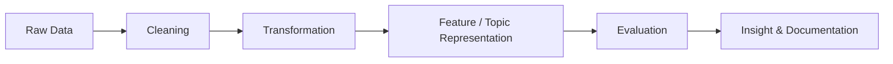

<div align="center">

# Hi, I'm Dimas Bratakusumah 👋

### Data Engineering Enthusiast · Informatics Student · Research Analytics Learner


<br/>


</div>

---

## About Me

I'm an Informatics student from Bandung, Indonesia, currently focusing on **Data Engineering**, **data processing pipelines**, and **research analytics**.

I enjoy working on projects that involve collecting, cleaning, transforming, analyzing, and validating data. My current research explores how scientific publication metadata can be processed into topic-based profiles to support researcher-to-research-group recommendation.

```text
Current direction:
Data Engineering · Data Pipelines · Research Analytics · Information Retrieval
```

---

## Current Focus

* Designing reproducible data processing workflows
* Working with structured and unstructured datasets
* Learning data engineering tools and pipeline architecture
* Exploring topic modeling and information retrieval for research analytics
* Improving repository documentation and project reproducibility

---

## Tech Stack

<table>
  <tr>
    <td><b>Languages</b></td>
    <td>
      
      
      
      
    </td>
  </tr>
  <tr>
    <td><b>Data & ML</b></td>
    <td>
      
      
      
      
    </td>
  </tr>
  <tr>
    <td><b>Database</b></td>
    <td>
      
      
      
    </td>
  </tr>
  <tr>
    <td><b>Tools</b></td>
    <td>
      
      
      
      
    </td>
  </tr>
</table>

---

## Featured Research

### Researcher-to-Research-Group Recommendation Simulation

An undergraduate thesis research project that builds a recommendation workflow using scientific publication metadata.

**Main idea:**
Transform publication titles and abstracts into topic-based researcher profiles, then compare them with research group profiles using similarity and divergence metrics.

**Methods used:**

* LDA
* BERTopic
* Cosine Similarity
* Jensen-Shannon Divergence
* Precision@k, Recall@k, F1@k, MRR, NDCG@k

**Data sources:**

* CSRankings
* DBLP
* Semantic Scholar

---

## Data Engineering Learning Path



Currently improving my skills in:

* Data ingestion
* Data cleaning and validation
* ETL pipeline design
* SQL and database modeling
* Research data processing
* Reproducible experiment workflows

---

## GitHub Stats

<div align="center">


</div>

---

## Connect

<div align="center">

<a href="mailto:dimasbratakusumah@gmail.com">
  
</a>
<a href="https://github.com/DimasBaskara666">
  
</a>
<a href="https://www.instagram.com/dimasbaskara18">
  
</a>

</div>

---

<div align="center">

> Building reliable data-driven systems, one pipeline at a time.

</div>
